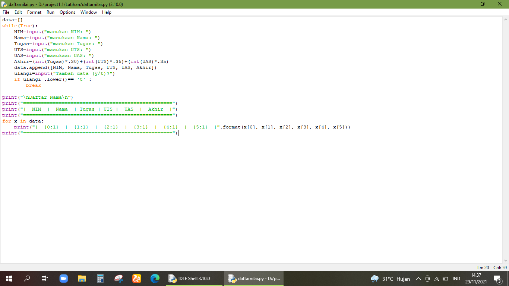
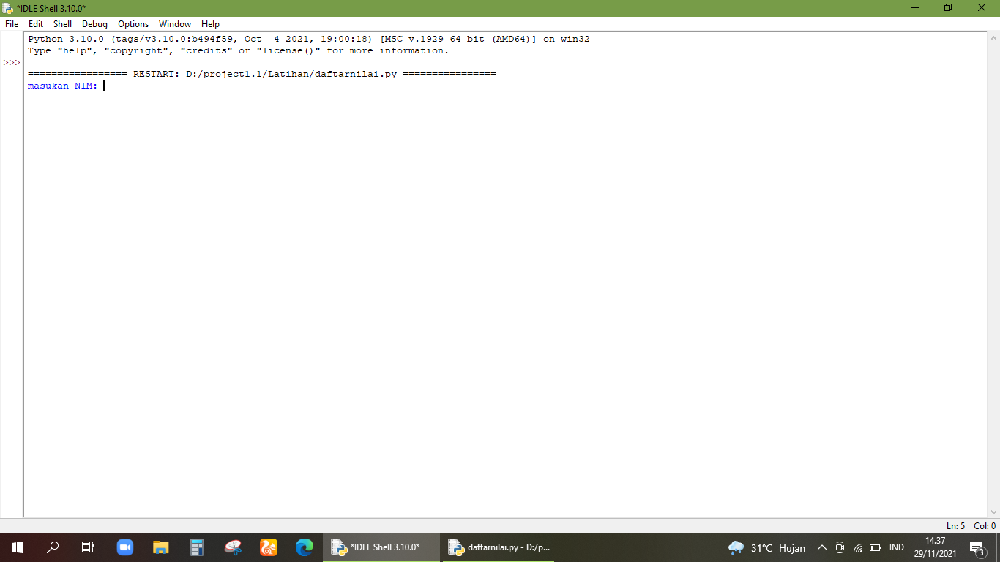
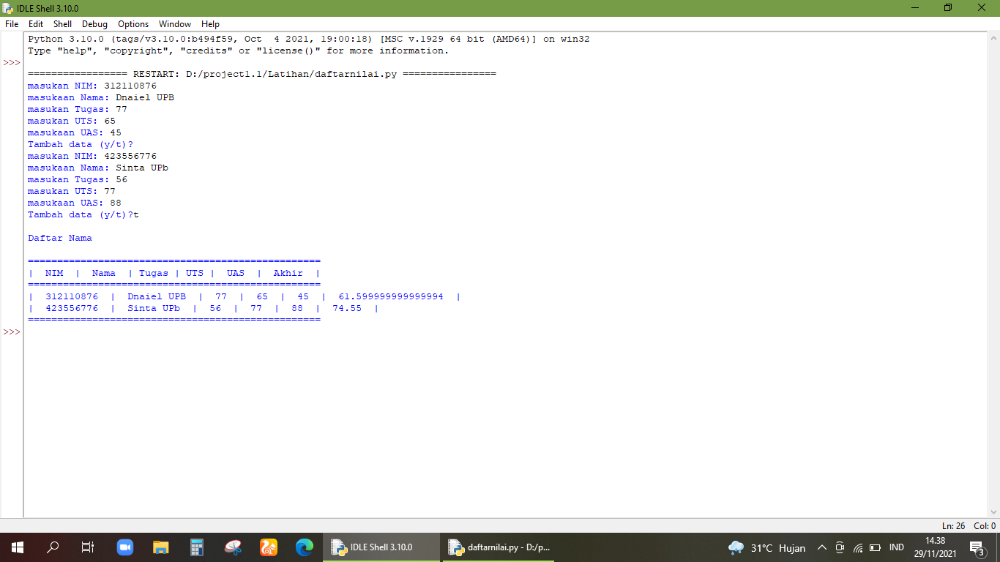

# pt9
## TUGAS PRAKTIKUM PERTEMUAN 9
Buat program sederhana untuk menambahkan data kedalam sebuah list dengan rincian sebagai berikut :
1. Program meminta memasukkan data sebanyak-banyaknya (gunakan perulangan)
2. Tampilkan pertanyaan untuk menambah data (y/t?),apabila jawaban T maka program akan menampilkan daftar datanya.
3. Nilai akhir diambil dari perhtungan 3 komponen nilai (tugas: 30%,uts: 35%, uas: 35%)
### Gambaran hasil kerja
1. Gambar dibawah ini adalah perintah atau codingan untuk tugas diatas 

2. Kil F5 atau Run,maka hasilnya akan seperti pada gambar berikut

3. Masukan NIM,Nama dan nilai yang ingin anda list,jika ingin menambahkan ketik perintah y(ya) jika data sudah lengkap klik t(tidak).maka hasilnya akan seperti pada gambar berikut

#### Terimakasih